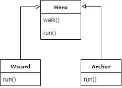
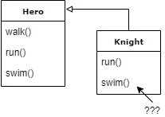

[&laquo; back to index](../../README.md)
# Strategy Pattern
## A bad (but realistic) scenario
_That is, how an architectural solution that seems to be a good idea at first, falls apart within a short time..._ 

Let's consider a real case, or at least a case that _could_ be real.

We are working on a video game, and the protagonist (our character) can initially perform 2 actions: walk and run.
At this early stage of the project, we offer the player a choice between a wizard and an archer.

We can then imagine to have a superclass called "Hero", with the methods "walk" and "run", and then 2 classes that extend it, one for the wizard and the other one for the archer. The "Hero" class also provides a basic implementation of those 2 methods, we could say "a default implementation".

**[UML FOR Hero, Wizard e Archer]**

Up to this point everything is proceeding well, but here comes a first request: implement a new action: **swim**, perhaps as a result of a game map expansion involving a lake.
The new `Hero` interface will then have a new method: `swim()`, which will have to be implemented both for the wizard (which, for example, will float on water), and for the archer.

At this point, however, a new character gets introduced: **the knight**.

**[UML FOR Hero, Knight]**

Unfortunately, the knight cannot swim, because his horse cannot enter the water and his heavy armor would drag him down, and yet, the programmer will still have to implement the `swim()` method, because it is defined this way at the "contract" (the interface) level.

In this case, one might choose to make explicit the fact that such an implementation of the method does not actually do anything, according to the idea that "not to swim" can be seen as a particular way of swimming, i.e.: the behavior of the knight when he is asked to swim is "not to swim".

Furthermore, he also has his own way of walking (he is on horseback), so it will be necessary to overload the `walk()` method.

And here comes a new request: introduce a new character, **the centaur**, which also has a particular way of walking, different from the default one, but identical to that of the knight.

As a result, the code of the `walk()` method of the knight and the one of the centaur will be absolutely the same! The code is 100% duplicated!

To get around this problem, we would need to create a specific class, something like `WalkAsAHorseBehavior', and have both characters extend that class, but what about other possible situations related to other methods, which may not combine in the right way? That is, are we sure that such a tight hierarchy has what it takes to give us the right flexibility?

In fact, proving that things are getting really unmanageable, here comes another request: our hero must be able to fight (a new method, then: `fight()`), for which the knight can use the base implementation, while the centaur needs its own specific implementation.

It becomes clear that inheritance works pretty well as long as method sharing happens "vertically", through a hierarchical structure, but when you need to share behaviors "horizontally", this is almost impossible, especially in languages that do not support multiple inheritance.

[next - Enter "Strategy Pattern" &raquo;](03_strategyPattern.md)
