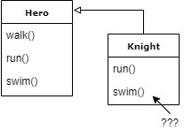

[&laquo; torna all'indice](../../README.md)
# Strategy Pattern
## Un pessimo (ma realistico) scenario
_Ovvero, come una soluzione architetturale che sembra una buona idea all'inizio, si sgretola nel giro di poco..._ 

Prendiamo in esame un caso reale, o almeno un caso che _potrebbe_ essere reale.

Stiamo lavorando ad un videogioco, ed il protagonista (il nostro personaggio) può inizialmente compiere 2 azioni: camminare e correre.
In questa fase iniziale del progetto, si offre al giocatore una scelta fra un mago ed un arciere.

Possiamo quindi immaginare di avere una superclasse "Hero", con i metodi "walk" e "run", e quindi 2 classi che la estendono, una per il mago e l'altra per l'arciere. La classe "Hero", inoltre, fornisce un'implementazione base dei 2 metodi, potremmo dire "di default".

**[UML PER Hero, Wizard e Archer]**

Fino a questo punto tutto procede bene, ma ecco che arriva una prima richiesta: implementare una nuova azione: **nuotare**, magari a seguito di un'espansione della mappa di gioco che prevede un lago.
La nuova interfaccia `Hero`, avrà quindi un nuovo metodo: `swim()`, che dovrà essere implementato sia per il mago (che, ad esempio, fluttuerà sull'acqua), che per l'arcere.

A questo punto, però, viene introdotto un nuovo personaggio: **il cavaliere**.

**[UML PER Hero, Knight]**

Purtroppo il cavaliere non può nuotare, perchè il suo cavallo non può entrare in acqua e la sua pesante armatura lo trascinerebbe a fondo, e tuttavia, il programmatore dovrà comunque implementare il metodo `swim()`, perchè così definito a livello di "contratto" (l'interfaccia).

In questo caso, si potrebbe scegliere di rendere esplicito il fatto che tale implementazione del metodo non faccia effettivamente nulla, secondo l'idea che "non nuotare" può essere visto come un particolare modo di nuotare, ovvero: il comportamento del cavaliere nel caso in cui gli sia richiesto di nuotare è "non nuotare".

Inoltre, questi ha anche un proprio modo di camminare (è a cavallo), per cui sarà necessario fare l'overload del metodo `walk()`. 

Ed ecco presentarsi una nuova richiesta: introdurre un nuovo personaggio, **il centauro**, che ha anche lui un particolare modo di camminare, diverso dal default, ma identico a quello del cavaliere.

Come risultato, il codice del metodo `walk()` del cavaliere e quello del centauro saranno assolutamente uguali! Il codice è completamente duplicato!

Per ovviare a questo problema, bisognerebbe creare una classe specifica, qualcosa come "WalkAsAHorseBehavior", e fare in modo che entrambi i personaggi estendano tale classe, ma come fare per altre eventuali situazioni relative ad altri metodi, che potrebbero non combinarsi nel modo giusto? Ovvero, siamo sicuri che una stretta gerarchia di tale tipo abbia le carte in regola per darci la giusta flessibilità?

Infatti, a dimostrazione che le cose si stanno facendo davvero poco gestibili, ecco arrivare un'altra richiesta: il nostro eroe deve poter combattere (un nuovo metodo, quindi: `fight()`), per il quale il cavaliere può usare l'implementazione base, mentre il centauro ha bisogno di una propria implementazione specifica.

Diventa chiaro che l'ereditarietà funziona finchè la condivisione dei metodo avviene "verticalmente", attraverso una struttura gerarchica, ma quando si ha la necessità di condividere comportamenti "orizzontalmente", questo risulta quasi impossibile, soprattutto nei linguaggi che non supportano l'ereditarietà multipla.

[successivo - Entra in scena lo "Strategy Pattern" &raquo;](03_strategyPattern.md)
