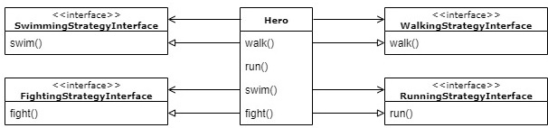

[&laquo; torna all'indice](../../README.md)
# Strategy Pattern
## Un po' di codice

Proviamo quindi rivedere l'esempio iniziale, ma questa volta ponendo l'accento sul disaccoppiamento fra client e algoritmi.
Questo approccio renderà gli algoritmi stessi intercambiabili, senza che si renda mai necessario modificare i client.

Innanzi tutto definiamo le interfacce, ovvero i "contratti" che le classi del codice dovranno rispettare.
L'adesione di una classe ad una o più interfacce, in questo senso, è molto conveniente, in quanto garantisce che le classi di una certa famiglia siano effettivamente intercambiabili.

Definiamo quindi un'interfaccia per ogni famiglia; chiameremo queste interfacce "strategie":
- `WalingStrategyInterface` - che imporrà il metodo `walk()` 
- `RunningStrategyInterface` - che imporrà il metodo `run()`
- `SwimmingStrategyInterface` - che imporrà il metodo `swim()`
- `FightingStrategyInterface` - che imporrà il metodo `fight()`

> **NOTA:**
>
> Esistono diversi modi per ottenere il risultato voluto, con differenti approcci e architetture. Quella proposta qui di seguito non è che una possibile opzione.
Un'alternativa, ad esempio, potrebbe essere quella di definire un'unica interfaccia, che "Hero" implementi, e che richieda tutti i metodi in una sola volta. Personalmente, tuttavia, ritengo che tale soluzione andrebbe contro i principi di progettazione "S.O.L.I.D." (Robert C. Martin), ed in particolare contro l'"Interface segregation principle" (la "I" di S.O.L.I.D.), risultando in una soluzione molto meno flessibile.
>
> Tali scelte dipendono, in ultima analisi, da molti fattori, non ultimo il contesto applicativo in cui si sta operando.

**[UML PER Hero E TUTTE LE SUE INTERFACCE]**



Naturalmente, serviranno delle classi concrete che implementino le interfacce (che, si ricorda, rappresentano le famiglie), ad esempio:
- `WalingStrategyInterface` potrebbe essere implementata dalle classi concrete `BipedWalkingStrategy` e `QuadrupedWalkingStrategy`
- `RunningStrategyInterface` potrebbe essere implementata dalle classi concrete `BipedRunningStrategy` e `QuadrupedRunningStrategy`
- `SwimmingStrategyInterface` potrebbe essere implementata dalle classi concrete `NormalSwimmingStrategy`, `FloatingSwimmingStrategy` e `NoSwimmingStrategy`
- `FightingStrategyInterface` potrebbe essere implementata dalle classi concrete `SwordFightingStrategy`, `BowFightingStrategy` e `MagicFightingStrategy`

In quest'ottica, la superclasse `Hero` non possiederà più alcuna implementazione di default dei metodi, ma si occuperà esclusivamente di "delegare" l'esecuzione di ciascuno di essi alla strategia designata.

Si noti che la classe Hero **"ha"** tutte le interfacce, ed al tempo stesso **"è"** tutte le interfacce coinvolte. Questo piccolo accorgimento, del tutto arbitrario e non indispensabile (ai fini del pattern, la prima condizione sarebbe sufficiente), ci permetterà di utilizzare lo stesso nome per i metodi delle singole strategie e per i metodi della classe Hero stessa.

Il passo successivo è quindi quello di "comporre" l'istanza della classe che rappresenta il nostro personaggio includendo le strategie più appropriate.
Ecco che la scelta delle strategie definisce, di fatto, il tipo di personaggio, che non necessiterà quindi di una propria classe. "Cavaliere" sarà quindi un'oggetto di tipo Hero, con un certo set di strategie a corredo.

Ad esempio, creare un mago significa istanziare una classe Hero con le strategie BipedWalkingStrategy, BipedRunningStrategy, FloatingSwimmingStrategy e MagicFightingStrategy.
mentre creare un cavaliere, significa istanziare la stessa classe Hero con le strategie QuadrupedWalkingStrategy, QuadrupedRunningStrategy, NoSwimmingStrategy, SwordFightingStrategy

**[Un riepilogo dei nostri eroi]**

| Walking          	| Running          	| Swimming         	| Fighting      	|                                                          	|
|------------------	|------------------	|------------------	|---------------	|----------------------------------------------------------	|
| BipedWalking     	| BipedRunning     	| FloatingSwimming 	| MagicFighting 	| È un mago!                                               	|
| QuadrupedWalking 	| QuadrupedRunning 	| NoSwimming       	| SwordFighting 	| È un cavaliere!                                          	|
| BipedWalking     	| BipedRunning     	| NormalSwimming   	| BowFighting   	| È un arciere!                                            	|
| QuadrupedWalking 	| QuadrupedRunning 	| NoSwimming       	| BowFighing    	| È un centauro!                                           	|
| BipedWalking     	| QuadrupedRunning 	| NoSwimming       	| SwordFighting 	| Un cavaliere che quando si ferma, scende da cavallo? :-) 	|

In pratica, non è nemmeno necessario avere una classe che rappresenti il cavaliere, l'arciere, e così via, in quanto queste sono tutte "declinazioni" della stessa classe "Hero" opportunamente configurata.

Diventa però imperativo che la configurazione dell'eroe avvenga passando le strategie "dall'esterno", e che le classi che definiscono i diversi comportamenti non vengano quindi mai istanziate all'interno di Hero.
Questo meccanismo è conosciuto con il nome di "dependency Injection", che nel nostro esempio avviene tramite il costruttore.


```php
class Hero implements WalkingStrategyInterface, RunningStrategyInterface, SwimmingStrategyInterface, FightingStrategyInterface
{

    private WalkingStrategyInterface  $walkBehavior;
    private RunningStrategyInterface  $runBehavior;
    private SwimmingStrategyInterface $swimBehavior;
    private FightingStrategyInterface $fightBehavior;


    public function __construct(
        WalkingStrategyInterface  $walkingStrategy,
        RunningStrategyInterface  $runningStrategy,
        SwimmingStrategyInterface $swimmingStrategy,
        FightingStrategyInterface $fightingStrategy
    )
    {
        $this->walkBehavior  = $walkingStrategy;
        $this->runBehavior   = $runningStrategy;
        $this->swimBehavior  = $swimmingStrategy;
        $this->fightBehavior = $fightingStrategy;
    }

    // ...
}
```
Come è possibile osservare chiaramente:
- i singoli comportamenti non vengono definiti nella classe, ma iniettati all'atto della creazione della classe concreta "Hero":
- il costruttore dichiara le strategie da iniettare come interfacce, MAI classi concrete (o l'intero meccanismo verrebbe meno)

```php
// main code

// Creating a Wizard by strategies...
$wizard = new Hero(
    new Strategies\Walking\BipedWalkingStrategy(),
    new Strategies\Running\BipedRunningStrategy(),
    new Strategies\Swimming\FloatingSwimmingStrategy(),
    new Strategies\Fighting\MagicFightingStrategy()
);

$wizard->walk();
$wizard->run();
$wizard->swim();
$wizard->fight();


// Creating an Archer by strategies...
$archer = new Hero(
    new Strategies\Walking\BipedWalkingStrategy(),
    new Strategies\Running\BipedRunningStrategy(),
    new Strategies\Swimming\NormalSwimmingStrategy(),
    new Strategies\Fighting\BowFightingStrategy()
);

$archer->walk();
$archer->run();
$archer->swim();
$archer->fight();
```

Mentre l'implementazione dei singoli metodi imposti dalle interfacce, all'interno della class Hero, diventa estremamente semplice, prevedendo, di fatto, il solo codice necessario per "delegare" il comportamento alla strategia designata.
```php
class Hero implements WalkingStrategyInterface, RunningStrategyInterface, SwimmingStrategyInterface, FightingStrategyInterface
{
    // ...
    
    public function walk(): void
    {
        $this->walkBehavior->walk();
    }

    public function run(): void
    {
        $this->runBehavior->run();
    }

    public function swim(): void
    {
        $this->swimBehavior->swim();
    }

    public function fight(): void
    {
        $this->fightBehavior->fight();
    }
}
```

Questa tecnica, soprattutto se associata alla buona pratica del "Factory Pattern" (che analizzeremo più avanti, in un altro articolo), permette di poter comporre il nostro eroe nel modo desiderato, anche a runtime!

### L'importanza della semantica
Vorrei spendere ancora qualche parola sull'importanza che ricopre, nella programmazione, il giusto uso della nomenclatura di classi, variabili, ecc...

Nel codice di esempio, le interfacce che rappresentano le famiglie di comportamento nei singoli ambiti, vengono definite "strategie", e non solo in onore dello strategy pattern.

La loro implementazione concreta, infatti, viene assegnata a varibili di istanza nominate "behavior". Ne consegue che, leggendo una riga di codice come questa (tratta dal costrutture della classe `Hero`):
```php
$this->swimBehavior = $swimmingStrategy;
```
si forma, nella mia mente, questo concetto: "Il comportamento dell'eroe nel caso in cui stia nuotando è quello di applicare la strategia di nuoto propria dell'eroe in oggetto".

Scrivere codice in modo che, rileggendolo, mi racconti una storia, è un'abitudine che coltivo ormai da diversi anni.
All'inizio mi sembrava inutile e artificioso utilizzare lunghi e complessi nomi per variabili e classi, quando `$i` e `$obj` è più che sufficiente all'interprete, ma forzandomi a farlo per qualche tempo ho capito che è tutt'altro che un puro esercizio di stile.

Dare il giusto nome alle cose, ti obbliga a ragionare sui confini di quelle stesse cose, a catalogare, differenziare, organizzare e dare il giusto taglio al pezzo di codice che stai scrivendo.
Ad esempio, quando una classe o un metodo sono difficili da descrivere (e quindi nominare) con poche parole, è normalmente un chiaro segnale che si sta cercando di mettere insieme troppe cose nella stessa porzione di codice, e che si sta probabilmente violando il principio di "single responsability".

Inoltre, avere dei nomi coerenti, organizzati in maniera consistente, aiuta molto nella comprensione del codice, il che è un bel vantaggio ogni qualvolta qualcuno si unisca al team per dare il proprio contributo, ed è esso stesso un buon modo per "validare" la qualità del ragionamento che sottende al codice scritto.

Nella mia esperienza, invece, quando più classi - pur se della stessa famiglia - hanno nomi semanticamente diversi, accomunarle è un'impresa che consuma buona parte delle energie nel tentativo di ricostruire il flusso logico della parte di codice che sto analizzando.

Non sottovalutate l'importanza della semantica!

[successivo - Eseguire il codice di esempio &raquo;](05_executeExample.md)
